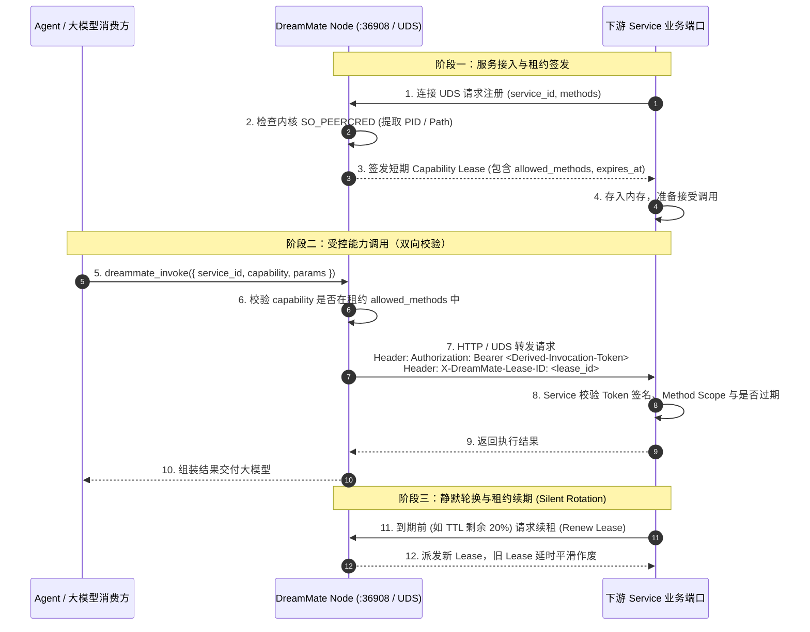

# DreamMate 节点与能力网格安全架构规范

> **定位**：DreamMate Network 与 Capability Mesh 的安全信任模型、威胁防护与演进规范。  
> **核心原则**：诚实面对威胁边界、杜绝“回环即绝对安全”的伪假设、从主机受信任模型渐进演进至基于短期租约（Capability Lease）的内核级零信任架构。

---

## 1. 核心认知修正：打破“127.0.0.1 = 100% 安全”假象

在传统的分布式或本地服务开发中，容易出现一种常见误区：**“只要服务只监听 127.0.0.1 / localhost，就是绝对安全的”**。

必须对这一认知进行系统性修正：

```
┌────────────────────────────────────────────────────────────────────────┐
│                        网络边界 vs 进程边界                            │
├────────────────────────────────────────────────────────────────────────┤
│  127.0.0.1 能够保证的：                                                │
│  ✔ 外部网络（局域网、公网）机器无法直接通过 TCP/IP 握手访问该端口。     │
│                                                                        │
│  127.0.0.1 根本无法保证的：                                            │
│  ✘ 本机其他非特权进程、同机其他用户或恶意程序无法访问。                │
│  ✘ 发起 `POST 127.0.0.1:36908/services` 的进程到底是哪个具体应用。     │
│  ✘ 本地回环端口不会被竞争占用（Port Stealing / Hijacking）。            │
└────────────────────────────────────────────────────────────────────────┘
```

一台电脑上的任意进程（包括普通用户权限运行的第三方脚本、后台进程）通常都可以向 `localhost:36908` 发起 HTTP 请求。  
这意味着：**单纯通过 `POST 127.0.0.1:36908/services` 报备，本质上无法证明“发起报备的进程真的是那个合法的 Service”**。

参考云原生与零信任标准（如 [SPIFFE/SPIRE Workload Endpoint](https://spiffe.io/docs/latest/spiffe-specs/spiffe_workload_endpoint/)），真正的零信任工作负载验证必须结合**内核元数据、操作系统文件级访问控制以及进程身份鉴真**。

为了兼顾当前 MVP 的极致轻量与未来长期的架构健壮性，DreamMate 确立明确的两阶段演进路线。

---

## 2. 威胁模型矩阵（Threat Model Matrix）

| 威胁场景 | Phase 1：当前 MVP（Trusted Host） | Phase 2：零信任网格（Zero Trust Mesh） |
| :--- | :--- | :--- |
| **外部网络远程直接扫描/调用服务私有端口** | **防范**（监听回环或防火墙隔离） | **防范**（Tailscale 互信 + 租约校验） |
| **外部网络跨机伪造注册向 Node 塞假服务** | **防范**（Node 严格限制仅接受 Loopback 写请求） | **防范**（仅接受本节点 UDS 注册） |
| **同机恶意进程伪造 service_id 进行覆盖报备** | ⚠️ **明确不防**（依赖主机可信假设） | **防范**（Node 提取内核 PID 与路径指纹校验） |
| **同机恶意进程直接调用下游服务的本地 HTTP 端口** | ⚠️ **明确不防**（依赖主机可信假设） | **防范**（Downstream 端口强制校验短期 Capability Lease） |
| **静态 Token 长期泄露与凭证被窃取重放** | ⚠️ **不防**（无 Token 或长效配置） | **防范**（短期 TTL + 细粒度 Scope + 签名防伪） |
| **跨节点调用权限冒用与越权请求** | ⚠️ **仅依赖网络层互信** | **防范**（Node 代理注入受众限定 Lease） |

---

## 3. Phase 1：MVP 阶段威胁模型（Trusted Host）

### 3.1 前提假设
- **环境受信任（Trusted Host）**：当前宿主机被视为单一可信安全域，假设主机上运行的进程均由当前合法用户授权启动，不存在恶意的同机非受信进程。
- **边界划分**：
  - **防范**：跨主机的非授权网络流量。
  - **不防范**：本机内部同一特权或非特权域下的恶意进程竞争与仿冒。

### 3.2 MVP 落地保护机制
1. **写接口回环绑定校验**：
   `POST /services` 与 `DELETE /services/:id` 是状态变更的唯一写入口，服务端严格判定请求的 `remoteAddress`，仅放行 `127.0.0.1` / `::ffff:127.0.0.1` / `::1`，阻断所有外网与 Tailnet 远程节点的直接写入。
2. **状态真实性校验（探活收敛）**：
   Node 不信任服务的静态声明，必须通过主动调用 `http://127.0.0.1:<port>/health` 证实服务真实可达，若连续探活失败 5 次则强制逐出（Eviction），避免僵尸服务常驻。
3. **可达性透明宣告**：
   在 `NodeManifest` 中如实暴露 `reachability: 'localhost'`，外部节点知晓其不可远程直连，阻断跨网络盲目尝试。

---

## 4. Phase 2：零信任与双向通信安全架构（Zero Trust via UDS & Capability Lease）

进入 Phase 2 后，DreamMate 将从“信任主机”演进至“基于租约的零信任双向通信架构”，全面解决同机进程鉴真与权限收敛。

### 4.1 通信通道演进：Unix Domain Socket (UDS)

淘汰基于 TCP 回环的报备入口，改用操作系统级 Unix Domain Socket（Linux / macOS）：
- **默认监听路径**：`~/.1agents/run/dreammate-node.sock`
- **文件系统自主访问控制（DAC）**：
  文件权限严格设置为 `0600`（`chmod 600`），仅允许当前启动用户自身的进程读写，**天然在操作系统内核层阻断其他系统用户的访问**。
- **Windows 适配**：采用 Named Pipe（如 `\\.\pipe\dreammate-node`），结合 Windows Security Descriptor（DACL）限定访问权限。

### 4.2 工作负载内核级鉴真（Process Identity Attestation）

当一个 Service 建立 UDS 连接向 Node 声明能力时，**Node 不会盲目信任连接发送的 JSON 内容**，而是通过内核元数据校验调用者身份：

```
┌─────────────────────────────────────────────────────────────┐
│                       Service 进程                          │
└──────────────────────────────┬──────────────────────────────┘
                               │ 1. Connect UDS
                               ▼
┌─────────────────────────────────────────────────────────────┐
│                    DreamMate Node 核心                       │
├─────────────────────────────────────────────────────────────┤
│ 2. 调用系统底层 API 提取对端凭证 (Kernel Peer Credentials):   │
│    - Linux: getsockopt(SO_PEERCRED) -> { pid, uid, gid }    │
│    - macOS: LOCAL_PEERCRED / LOCAL_PEERPID                  │
│ 3. 根据 PID 查询进程实况:                                    │
│    - 可执行文件路径 (proc_pidpath / /proc/<pid>/exe)         │
│    - 二进制文件 SHA256 哈希指纹                              │
│    - 容器命名空间 (cgroups / namespace / container ID)      │
│ 4. 判定 Workload 是否具备合法声明该 service_id 的权限         │
└─────────────────────────────────────────────────────────────┘
```

通过内核提取调用者元数据，彻底杜绝了普通进程通过随机伪造 `service_id` 篡夺合法服务报备的可能。

### 4.3 签发权威反转：Node 签发短期 Capability Lease

在传统幼稚设计中，往往是“Service 自己生成一个 Secret 告知 Node”。这存在致命漏洞：**谁来证明提供 Secret 的人就是拥有该能力的人？**

在 DreamMate Phase 2 零信任架构中，**权威必须反转**：
> **不是 Service 自己生成 Secret 给 Node；**  
> **而是 Node 在严格验证 Service 的进程身份后，由 Node 向 Service 签发短期凭据——Capability Lease（能力租约）。**

```
                  ┌──────────────────────┐
                  │    Service 进程      │
                  └──────────┬───────────┘
                             │ 1. 注册请求 (Register Request)
                             ▼
                  ┌──────────────────────┐
                  │   DreamMate Node     │
                  │   (本地信任根/CA)    │
                  └──────────┬───────────┘
                             │ 2. 内核身份鉴真通过
                             │ 3. 签发短期 Capability Lease
                             ▼
                  ┌──────────────────────┐
                  │   Capability Lease   │
                  └──────────────────────┘
```

#### Capability Lease 数据结构规范

```typescript
export interface CapabilityLease {
  /** 租约全局唯一追踪 ID (UUIDv4) */
  lease_id: string;

  /** 被授权服务的唯一标识 */
  service_id: string;

  /** 允许执行的方法与能力列表 (Method-Level Least Privilege) */
  allowed_methods: string[];

  /** 调用受众边界 (Audience: 限制凭证只能被指定 Node 或 Caller 使用) */
  audience: {
    node_id: string;      // 签发本租约的本地 Node ID
    caller: 'local' | 'tailnet' | 'any';
  };

  /** 签发与过期时间 (严格的时间窗口 TTL，例如 5~15 分钟) */
  issued_at: number;      // Unix timestamp (ms)
  expires_at: number;     // Unix timestamp (ms)

  /** Node 私钥/种子签发的防篡改签名 (HMAC-SHA256 或 Ed25519) */
  signature: string;
}
```

### 4.4 双向安全交互与调用时序（Bidirectional Mutual Verification）

整个调用链形成严密的双向通信闭环：



### 4.5 核心安全特性剖析

1. **瞬时性与平滑轮换（TTL & Silent Rotation）**：
   租约有效周期极短（如 300 秒）。到期前由 Service 在后台静默续租。即使凭证在传输过程中意外泄露，也会在几分钟内自动失效，极大降低暴露面。
2. **主动吊销（Instant Revocation）**：
   当服务异常退出、探活失败或被管理员手动注销时，Node 在本地注销表加入 `lease_id` 黑名单，后续代理调用立即切断，不需要等待 TTL 到期。
3. **方法级最小权限（Method-Level Scope）**：
   `allowed_methods` 严格限制可调用能力。大模型或调用方无法越过已授权的 API 范围去调用 Service 内可能存在的未开放危险方法。
4. **受众限定与防重放（Audience Restriction）**：
   Lease 中绑定了 `audience.node_id` 与调用场景，防止攻击者拿从 Node A 抓取的凭证去跨机重放到 Node B 的同名服务中。

---

## 5. 跨节点 Tailnet 网格安全互信（Node-to-Node Mesh）

当发生跨机能力调用（如 Node A 的大模型调用 Node B 上的 `tingqi-adapter`）时：

```
┌─────────────────┐                     ┌─────────────────┐
│     Node A      │                     │     Node B      │
│ (消费方所在宿主) │                     │ (服务所在物理机) │
└────────┬────────┘                     └────────┬────────┘
         │                                       │
         │ 1. Tailscale WireGuard 权威身份通道   │
         │    (验证 Node A 的 Tailnet IP / Node) │
         ├──────────────────────────────────────>│
         │                                       │ 2. Node B 验证 Node A 具备访问授权
         │                                       │ 3. Node B 在本机派生本地租约
         │                                       │    Header: Authorization: Bearer <Local-Lease>
         │                                       ▼
         │                              ┌─────────────────┐
         │                              │  下游 Service   │
         │                              └─────────────────┘
```

1. **传输与节点身份**：完全依托 Tailscale WireGuard 提供的双向加密网络与权威身份（`tailscale whois`），节点之间无需再次协商复杂的私有 TLS 证书。
2. **本地代为授权**：远程请求抵达 Node B 后，Node B 代表远程调用方将请求翻译并注入由 Node B 签发的**本地短期 Capability Lease** 调用 Service。
3. **零跨网暴露**：下游 Service 本身仅监听回环甚至仅监听 UDS，**绝不需要对外暴露端口**，彻底杜绝端口暴露风险。

---

## 6. 演进实施指南与兼容性原则

为避免早期过度设计破坏极简与易用性，演进应遵循以下原则：

1. **保持客户端开发体验极简（DX First）**：
   无论是 Phase 1 的 TCP 回环还是 Phase 2 的 UDS + Capability Lease，所有底层协议细节（UDS 连接、内核凭证响应、租约自动续期、验签中间件）全部封装在 `@1agents/dreammate-node/client` SDK 中，业务开发者使用 `reportAndHoldRegistration` 的体验保持零心智负担。
2. **非破坏性渐进迁移**：
   Phase 2 落地时，`dreammate-node` 可同时提供 UDS（强安全通道）与可选的 TCP Loopback（兼容调试通道）。调试环境允许通过环境变量 `--insecure-loopback` 开启降级模式，生产与常驻运行模式强制启用 UDS 与 Capability Lease。
3. **文档与事实源统一**：
   所有对外文档、README 与架构说明中，均应遵循本规范的威胁模型边界定义，严禁出现“回环即 100% 安全”的误导性表述。
